# Slides Studio

[](https://github.com/ZhadowValker/Slides-Studio/actions/workflows/deploy.yml)
[](https://github.com/ZhadowValker/Slides-Studio/actions/workflows/ci.yml)

A slide editor that runs entirely in your browser. Build a deck, present it full screen, and export it to PowerPoint or PDF. The whole app is one file, `index.html`, so it needs no server and no build step.

**Live site:** https://zhadowvalker.github.io/Slides-Studio/

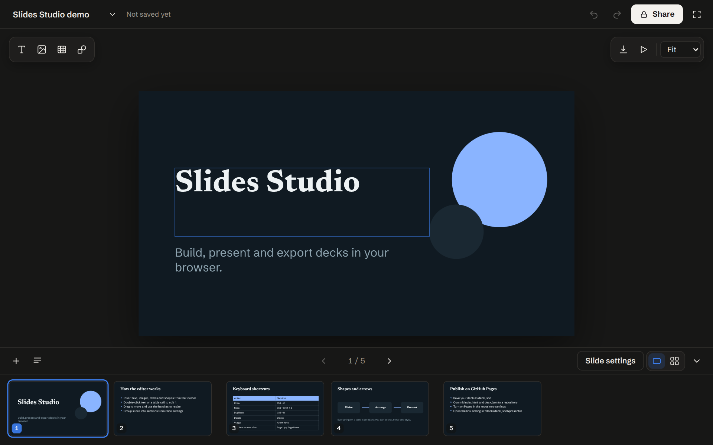

## What you can do

- Add text, images, tables and shapes (rectangle, rounded rectangle, ellipse, line and arrow).
- Move, resize, duplicate, reorder and delete anything on a slide.
- Set the **opacity** of any element, from 0 to 100%.
- Group slides into **sections**, rename them, and drag whole sections into a new order.
- Add speaker notes, switch between three themes, and present full screen.
- Export to **PowerPoint (.pptx)** or **PDF**, or save the deck as a `.json` file.
- Connect **Google Drive** to save and open decks, autosave to Drive, export to Drive or Google Slides, and insert images from Drive.
- Undo and redo every change. Your work is saved in your browser as you go.

## Quick start

**Use it online.** Open the live site above. It starts with a sample deck that tours the editor.

**Run it on your computer.** You need nothing but a browser. Either open `index.html` directly, or serve the folder:

```bash
npm start          # serves http://localhost:8080 (needs Python 3)
```

> The PowerPoint export and the fonts load from the internet, so they need a connection.

## A tour of the editor

### Insert and format

Use the toolbar at the top left to add text, an image, a table or a shape. Click anything on the slide to select it. A format bar appears with the controls for that kind of element: font, size, bold, italic, alignment, colors, and more. Double-click text or a table cell to edit it. In a table, press **Tab** to move to the next cell.

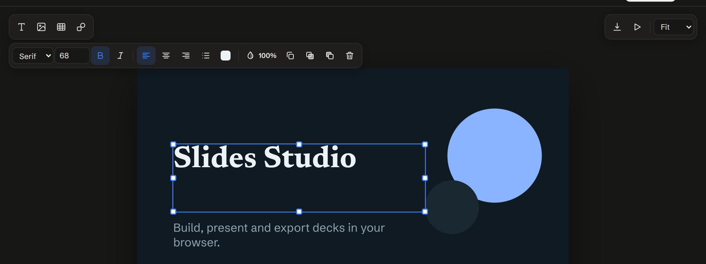

### Opacity

Every element has an opacity control, the droplet icon at the right of the format bar. Click it and drag the slider, or type a number. The selection outline and handles stay fully visible, so you can still find an element at 0%.

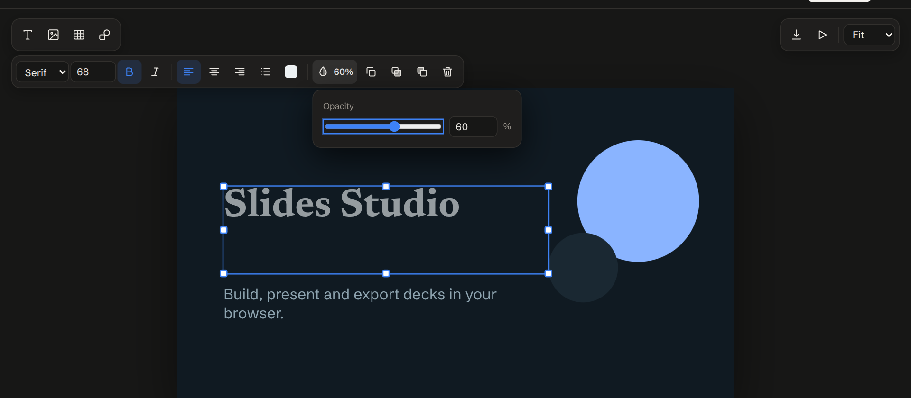

### Slides and sections

The strip along the bottom shows every slide. Hover a slide to **duplicate** or **delete** it, and drag slides to reorder them.

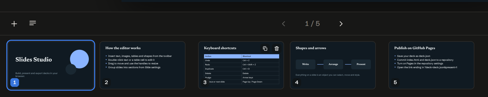

Click the grid icon at the bottom right to see all slides grouped by section. Hover a section heading to get a grip you can **drag to reorder** the section, and a trash button that **removes the section** without deleting its slides. Double-click a heading to rename it. The **+** at the bottom adds a new section at the end.

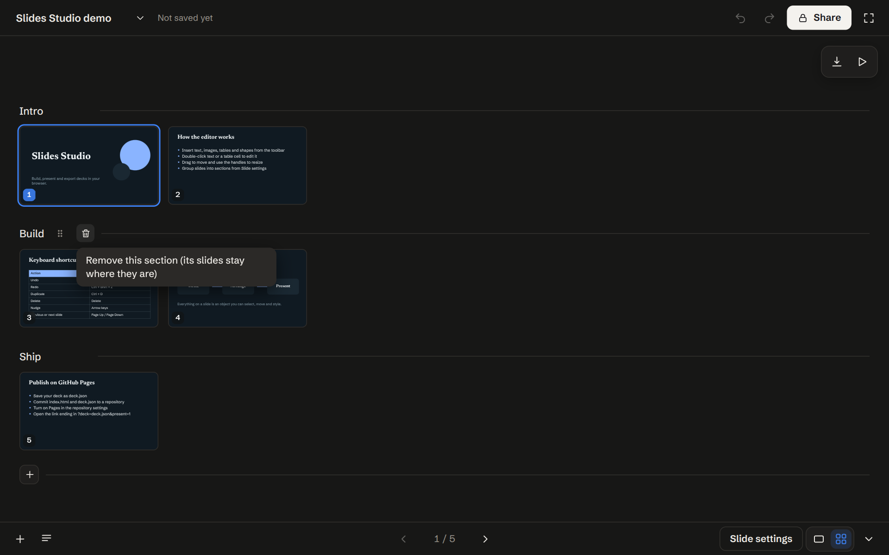

**Slide settings** (bottom right) sets the section, the theme for the whole deck, and the background of the current slide.

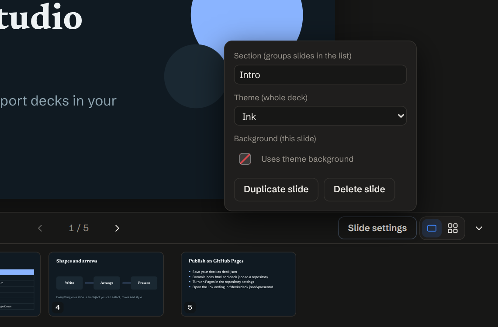

### Present, save and export

The download icon at the top right opens the save and export menu. The play icon presents the deck full screen.

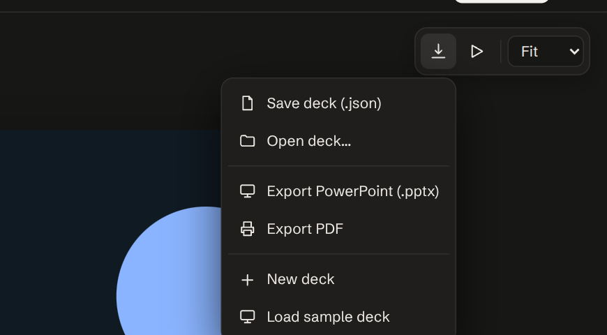

| Menu item | What it does |
| --- | --- |
| Save deck (.json) | Downloads the whole deck, including images, as `deck.json`. |
| Open deck… | Loads a `.json` deck you saved earlier. |
| Export PowerPoint (.pptx) | Downloads a PowerPoint file with your text, shapes, images, tables, opacity and speaker notes. |
| Export PDF | Opens the print dialog. Choose **Save as PDF** and turn on **Background graphics**. |

### Keyboard shortcuts

| Action | Shortcut |
| --- | --- |
| Undo / redo | `Ctrl + Z` / `Ctrl + Shift + Z` (`Cmd` on Mac) |
| Duplicate the selected element | `Ctrl + D` |
| Copy / paste an element | `Ctrl + C` / `Ctrl + V` |
| Delete the selected element | `Delete` |
| Nudge by 1 px (10 px with `Shift`) | Arrow keys |
| Previous / next slide | `Page Up` / `Page Down` |
| Deselect | `Esc` |
| In present mode: next / previous / exit | `→` or `Space` / `←` / `Esc` |

## Connect Google Drive

The cloud icon next to the save menu connects Slides Studio to your own Google Drive. Everything runs in your browser. There is no server, and the app asks only for the `drive.file` permission, so it can see files it created or files you pick, nothing else.

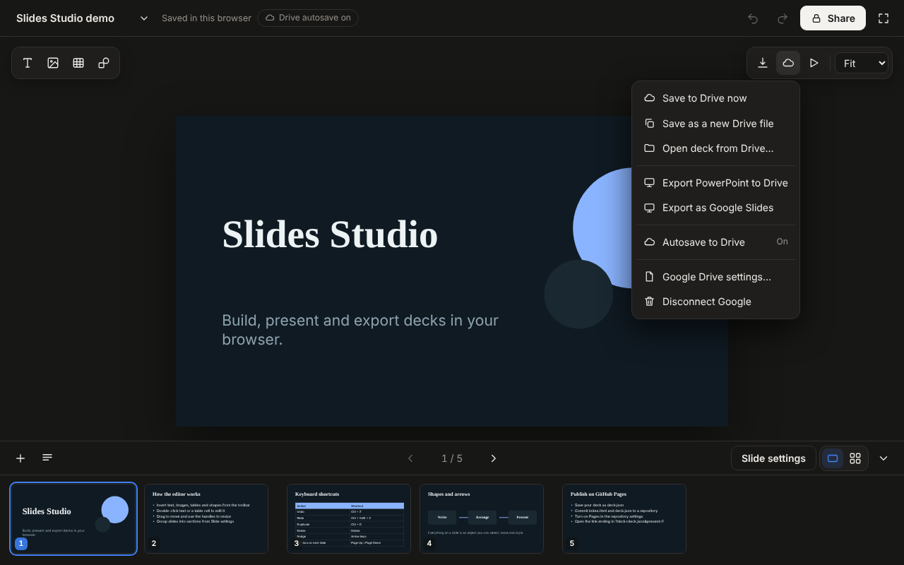

| Menu item | What it does |
| --- | --- |
| Save deck to Drive | Creates `<title>.slides-studio.json` in a **Slides Studio** folder and links the deck to it. |
| Save to Drive now / Save as a new Drive file | Updates the linked file, or makes a separate copy. |
| Open deck from Drive… | Opens the Google file picker. The deck you choose becomes the linked deck. |
| Export PowerPoint to Drive | Uploads a `.pptx` to the Slides Studio folder. |
| Export as Google Slides | Uploads the deck and lets Drive convert it to a Google Slides file. |
| Autosave to Drive | When on, changes are saved to the linked file about four seconds after you stop editing. A small chip next to the title shows the status. |
| Add image → From Google Drive | Picks an image from Drive and adds it to the slide. |
| Disconnect Google | Revokes the access token and unlinks the deck. Your Drive files are untouched. |

### One-time setup

Google requires every web app to use its own keys. This takes about ten minutes and costs nothing.

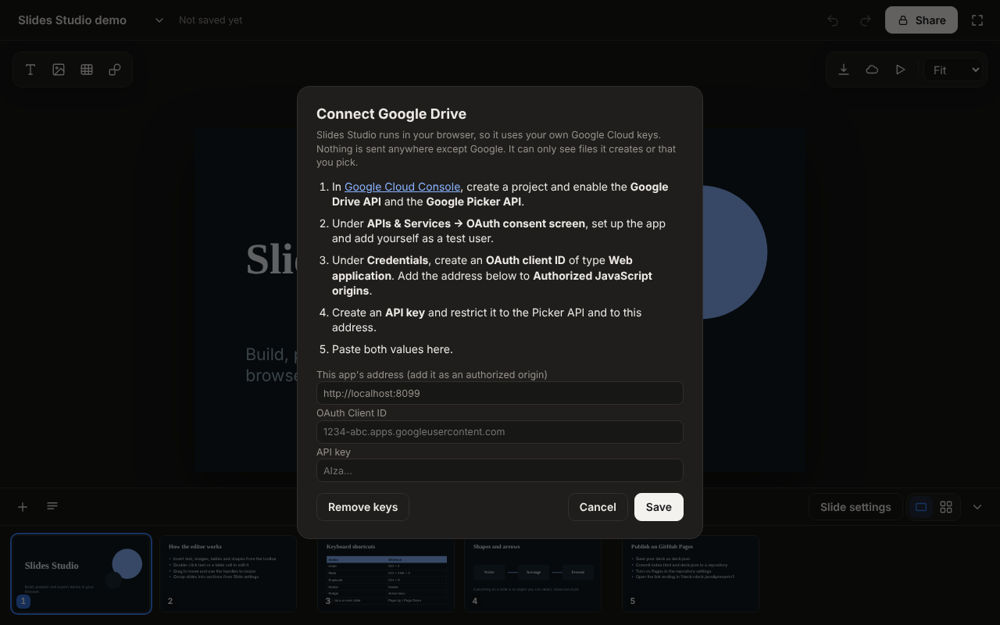

1. Open the [Google Cloud Console](https://console.cloud.google.com/) and create a project.
2. Enable the **Google Drive API** and the **Google Picker API** (**APIs & Services → Library**).
3. Under **OAuth consent screen**, set up the app (External is fine) and add your Google account as a **test user**.
4. Under **Credentials**, create an **OAuth client ID** of type **Web application**. Add your site's address to **Authorized JavaScript origins**, for example `https://YOUR-NAME.github.io` or `http://localhost:8080`. Use the origin only, with no path.
5. Create an **API key** and restrict it to the Picker API and your site's address.
6. In Slides Studio, choose the cloud icon, then **Set up Google Drive…**, and paste the Client ID and API key.

The keys are stored only in your browser. The Client ID and API key are not secrets in the way a password is, but keep the API key restricted. To bake them into your published site for everyone who opens it, fill in `GOOGLE_DEFAULTS` near the top of the Drive section in `index.html`.

Access tokens are held in memory and are never saved. After a reload, the next Drive action asks Google for a fresh token, usually without a prompt.

## Publish with GitHub Pages

Follow these steps once. After that, every change you push is checked and published automatically.

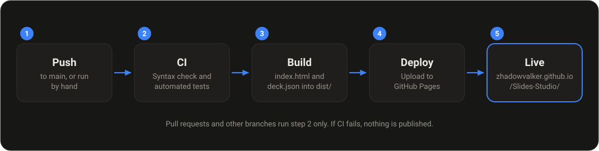

### 1. Switch on GitHub Pages

In the repository, open **Settings → Pages**. Under **Build and deployment**, set **Source** to **GitHub Actions**.

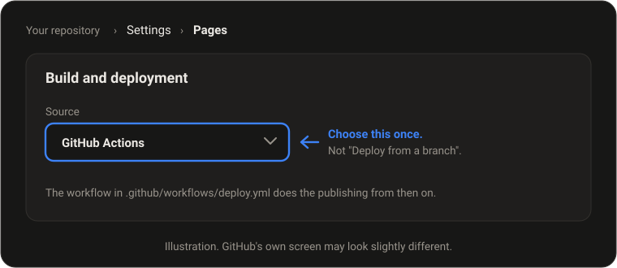

### 2. Add the files to the repository

You can use the website or Git. Either way, the repository should end up with the files listed under [Project structure](#project-structure).

**With the GitHub website**

1. Open the repository and click **Add file → Upload files**.
2. Drag in everything from this project **except** `node_modules`. If your file manager hides the `.github` folder, skip it for now and do step 4.
3. Click **Commit changes**.
4. If `.github` is missing, click **Add file → Create new file**, type `.github/workflows/deploy.yml` as the file name (typing the slashes creates the folders), paste in the contents of that file, and commit. Repeat for `.github/workflows/ci.yml` and `.github/dependabot.yml`.

**With Git**

```bash
git clone https://github.com/ZhadowValker/Slides-Studio.git
cd Slides-Studio
# copy the project files in here, including the hidden .github folder, then:
git add .
git commit -m "Add Slides Studio"
git push origin main
```

### 3. Watch it deploy

Open the **Actions** tab. The **Deploy to GitHub Pages** workflow starts on its own. When all three steps (CI, Build site, Deploy) show a green tick, your site is live at:

**https://zhadowvalker.github.io/Slides-Studio/**

The first run can take a couple of minutes. You can also start it by hand: **Actions → Deploy to GitHub Pages → Run workflow**.

## How the CI/CD pipeline works

There are two workflows in `.github/workflows/`.

| Workflow | Runs when | What it does |
| --- | --- | --- |
| `ci.yml` | A pull request is opened or updated, a branch other than `main` is pushed, or it is started by hand. The deploy workflow also calls it. | Installs dependencies, runs `npm run check` (script syntax, required page elements, `deck.json` validity) and `npm test` (editor behavior and PowerPoint export). |
| `deploy.yml` | A push to `main`, or started by hand. | Runs `ci.yml` first. If it passes, it copies `index.html`, `deck.json` and the optional `decks/` folder into `dist/`, uploads that as the site, and deploys it to GitHub Pages. |

If CI fails, nothing is published and the live site keeps its previous version. Dependabot (`.github/dependabot.yml`) opens a weekly pull request when a GitHub Action or a test dependency has a new version.

## Publish your own deck

The live site opens the sample deck by default. To publish a deck of your own:

1. In the editor, choose **Save deck (.json)**.
2. Add the file to the repository root and name it `deck.json`. To publish several decks, put them in a folder called `decks/` instead.
3. Commit it. The workflow redeploys.
4. Share the link. The **Share** button in the editor builds it for you:

   ```
   https://zhadowvalker.github.io/Slides-Studio/?deck=deck.json&present=1
   ```

   For a deck in the `decks/` folder, use `?deck=decks/my-talk.json&present=1`. Leave out `&present=1` to open it in the editor instead of full screen.

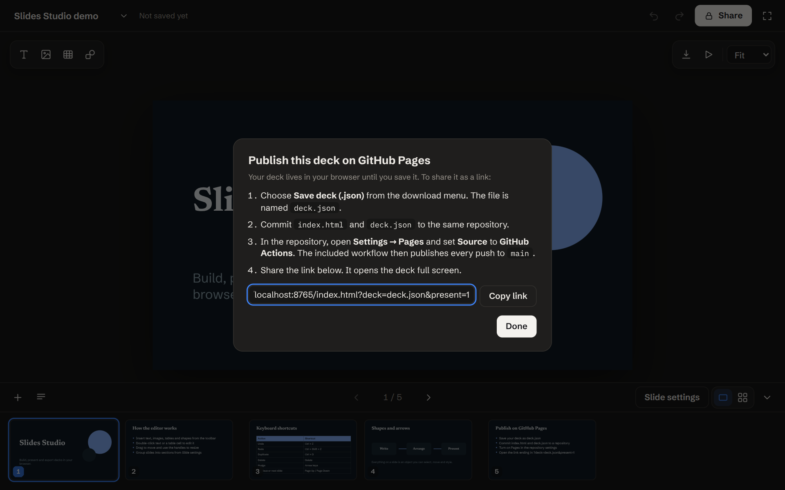

## Project structure

```
Slides-Studio/
├── index.html                 The whole app (HTML, CSS and JavaScript)
├── deck.json                  The sample deck, used by the Share link
├── package.json               Scripts and test dependencies
├── package-lock.json
├── scripts/
│   └── check.mjs              Static checks for index.html
├── tests/
│   ├── helpers.mjs            Loads index.html in a simulated browser
│   ├── slides.test.mjs        Editor behavior tests
│   ├── export.test.mjs        PowerPoint export test
│   └── drive.test.mjs         Google Drive tests with a simulated Google
├── docs/images/               Screenshots and diagrams used in this README
└── .github/
    ├── dependabot.yml
    └── workflows/
        ├── ci.yml             Check and test
        └── deploy.yml         Check, build and publish to GitHub Pages
```

## Development

You need Node.js 20 or newer.

```bash
npm ci            # install the test tools
npm run check     # static checks, about a second
npm test          # editor and export tests
npm run ci        # both of the above, the same as the CI workflow
npm start         # serve the app at http://localhost:8080
```

The tests run `index.html` in a simulated browser (jsdom), so they cover the logic and the exported PowerPoint file, not the pixel layout. Check how a change looks in a real browser before you push it.

`pptxgenjs` is pinned to `3.12.0` on purpose. It is the version `index.html` loads from the CDN, and the tests need to use the same one. If you change the version in the `<script>` tag, change it in `package.json` too.

## Troubleshooting

| Problem | What to do |
| --- | --- |
| The **Build site** step fails at *Set up Pages* with a "Not Found" error | Pages is not switched on for Actions yet. Do [step 1](#1-switch-on-github-pages). |
| The deploy job is blocked by an environment rule | Open **Settings → Environments → github-pages** and make sure the `main` branch is allowed to deploy. |
| The site shows a 404 right after the first deploy | Wait a minute or two and refresh. Also check the **Actions** tab for a red cross. |
| CI fails at `npm ci` | `package.json` and `package-lock.json` are out of sync. Run `npm install` locally and commit the updated lock file. |
| The Share link shows the sample deck, not yours | `deck.json` is missing from the repository root, or the file name in the link does not match. |
| The workflow does not start | Your default branch may be called `master`. Change `branches: [main]` in `deploy.yml` to match. |
| The PowerPoint export says the library did not load | The page could not reach the CDN. Check your connection and try again. |
| Google sign-in says the origin is not allowed | The address in the address bar must match an **Authorized JavaScript origin** exactly. Opening `index.html` as a file does not work. Use GitHub Pages or `npm start`. |
| The Drive picker does not open | Check that the **Google Picker API** is enabled and that the API key is allowed to use it. |
| "Drive paused" next to the title | Google needs you to sign in again. Click the chip. |
| My deck is gone | Autosave is stored in one browser on one device. Use **Save deck (.json)** to keep a copy you can move. |

## Good to know

- Slides are 16:9. Fonts (Newsreader, Schibsted Grotesk, IBM Plex Mono) load from Google Fonts. Without a connection the browser's default fonts are used.
- In the PowerPoint export, the three fonts map to Georgia, Calibri and Consolas so that the file opens predictably on any computer. Table colors with reduced opacity are blended into the slide background, because PowerPoint tables do not support transparency.
- Reordering sections and slides by dragging uses the browser's drag-and-drop, which usually does not work on touch screens.
- Google Drive tests use a simulated Google, so CI never signs in to a real account.
- There is no AI assistant in this app.
